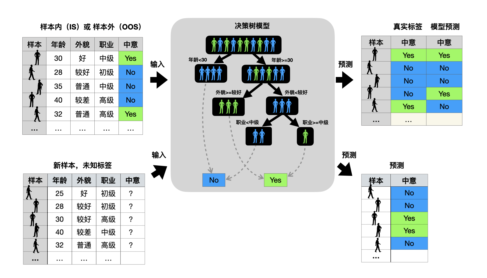

# Business-Data-Analytics
 《商业数据分析》的授课课件（包含作业）

## 本课件的特点
- 课上练习多，且容易上手。每一个知识点均搭配一个练习，帮助学生迅速巩固对于知识点的理解。
- 课后作业场景丰富，具有挑战性。增加了较多商业场景，避免编程知识和商业场景脱离。
- 图片多，示例多。大部分知识点应用可视化的方式，降低学习难度。

## 课件目录
- 第1章_商业数据分析导论
  - 1.1 大数据的概念.ipynb
  - 1.2 案例与前沿.ipynb
  - 1.3 Python介绍.ipynb
  - 附录-latex语法.ipynb
  - 附录-markdown语言.ipynb
  - 附录-为什么学习编程和Python.ipynb
  - 附录-为什么我输入慢.ipynb
  - 附录-解决jupyterlab浏览器无法跳转问题.pdf
  - 附录_Jupyter介绍.ipynb
  - 附录_Jupyter在线使用.ipynb
- 第2章_Python基本知识
  - 1 数据类型.ipynb
  - 2 流程控制.ipynb
  - 3 函数与模块.ipynb
  - 作业.ipynb
  - 练习答案.ipynb
  - 附录-函数的参数.ipynb
  - 附录-更多练习与答案
  - 附录-输入输出
  - 附录-面向对象
- 第3章_Numpy科学计算包
  - 3.1 Numpy介绍.ipynb
  - 3.2 Numpy的一维数组.ipynb
  - 3.3 Numpy的二维数组.ipynb
  - 3.4 Numpy的应用.ipynb
  - 作业.ipynb
  - 练习答案.ipynb
  - 附录：Array programming with NumPy.pdf
  - 附录：help以及文档帮助.ipynb
- 第4章_Pandas数据分析包
  - 4.1 Pandas介绍.ipynb
  - 4.2 Pandas的数据框.ipynb
  - 4.3 描述性统计方法.ipynb
  - 作业.ipynb
  - 附录： DataFrame详细方法.ipynb
  - 附录： Series详细方法.ipynb
  - 附录：Pandas-Cheat-Sheet.pdf
  - 附录：Pandas官方文档.pdf
- 第5章_Matplotlib绘图包
  - 5.1 可视化入门.ipynb
  - 5.2 matplotlib入门.ipynb
  - 作业.ipynb
  - 附录：matplotlib cheetsheet.pdf
  - 附录：matplotlib手册.pdf
  - 附录：中文无法正常显示的问题.ipynb
  - 附录：折线图.ipynb
  - 附录：散点图.ipynb
  - 附录：直方图和柱状图.ipynb
  - 附录：箱线图.ipynb
  - 附录：饼图.ipynb
- 第6章_数据源处理
  - 1 数据源.ipynb
  - 2 网页爬虫.ipynb
  - 3 数据预处理.ipynb
  - 作业.ipynb
  - 附录：用Python写网络爬虫.pdf
- 第8章_机器学习模型
  - 8.1_机器学习导论
  - 8.2_线性回归
  - 8.3_决策树
  - 8.4_聚类
  - 8.5_神经网络

## 部分课件示例
if 语句单分支结构的语法形式为：
```python
if(条件表达式):
    语句块
```


简单随机划分（Simple Random Sampling）：将原始数据集随机划分为训练集和测试集两部分，通常将数据集的 70% 到 80% 作为训练集，剩余部分作为测试集。


模型训练完，也就是决策树生成完毕后，就可以将样本内的数据输入到模型中。然后，观察模型预测的结果和真实的标签，两者之间的差异，这代表了模型的学习能力。


在模型学习到刘小姐的偏好后，就可以在刘小姐不在线的时候，也可以帮助其筛选样本了。当输入新的未知标签的数据到模型，模型会根据已经训练后的决策树的路径，很多就可以对样本进行分类，属于“Yes”还是“No”。

